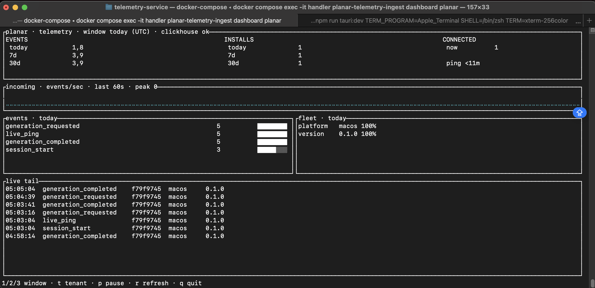

# peak

Authenticated, multi-tenant telemetry ingestion backed by ClickHouse, with a terminal dashboard.



See what all your projects — web and local installs — are doing right now, from a terminal. No
Grafana, no browser, no heavyweight observability stack.

## Quick start

```sh
cp .env.example .env
cargo run -- keygen planar
```

`keygen` prints a `planar:<secret>` pair. Put it in `.env` as `INGEST_KEYS`, and set
`CLICKHOUSE_PASSWORD` and `TELEMETRY_DOMAIN` (`localhost` for a local run). All three need real
values or Compose refuses to start.

Start ClickHouse and the ingest handler:

```sh
docker compose up -d --build clickhouse handler
curl http://127.0.0.1:8081/healthz
```

Open the dashboard:

```sh
docker compose exec -it handler peak dashboard planar
```

Add `caddy` (or drop the service names) to `docker compose up` to bring up the TLS reverse proxy on
ports 80 and 443.

## Sending events

`POST /v2/events` takes a JSON array and a bearer token:

```json
[
  {
    "event_id": "b9c176a4-badc-47a9-afbf-4a01cf1d65b9",
    "event_name": "session_start",
    "schema_version": 1,
    "occurred_at": "2026-08-05T12:34:56.789Z",
    "subject": { "kind": "install", "id": "1dd9d9c1-0bb4-4b21-b665-7f79d9f3e256" },
    "session_id": "679590a4-eea6-4e91-aeb0-23c8aa90ccaa",
    "resource": {
      "service_name": "example-client",
      "service_version": "0.1.0",
      "platform": "macOS",
      "platform_version": "15.0"
    },
    "attributes": {}
  }
]
```

The tenant comes from `Authorization: Bearer <secret>`. Only `(tenant, event_name, schema_version)`
combinations declared in a manifest are accepted. The response is `200` with
`{ "accepted": N, "rejected": [...] }`; accepted events are fsynced to a write-ahead log before the
response returns and reach ClickHouse a few seconds later.

Bodies may be plain JSON, `Content-Encoding: gzip`, or `Content-Encoding: zstd`. Compress your
batches.

[`load_test.py`](load_test.py) is a dependency-free client for exercising the endpoint:

```sh
INGEST_TOKEN='<the secret>' python3 load_test.py
```

## Tenants

Each tenant is one TOML manifest in [`tenants/`](tenants) declaring its events and their fields.
[`_example.toml`](tenants/_example.toml) documents every option and is ignored by the loader.

To add a tenant: copy the example to `tenants/<name>.toml`, run `cargo run -- keygen <name>`, append
the pair to `INGEST_KEYS` (comma-separated), and restart.

## Dashboard

The dashboard is read-only and needs no ingest key, so it is safe to run inside the production
network.

| Key | Action |
| --- | --- |
| `1` `2` `3` | switch time window |
| `t` / `Shift+T` | next / previous tenant |
| `p` | pause polling |
| `r` | refresh |
| `q` / `Esc` | exit |

Windows are whole calendar days in `DASHBOARD_TIMEZONE` (default `UTC`), so the same window means
the same span wherever the dashboard runs. The live chart is a rolling 60 seconds. `CONNECTED`
counts installs whose liveness ping arrived recently; tenants without a liveness event show `--`.

## Configuration

Secrets and deployment settings come from `.env` — see [`.env.example`](.env.example) for every
variable and its default. Non-secret service settings live in [`config.json`](config.json).

The knobs you are most likely to touch:

- `MAX_INSERT_BATCH_EVENTS` / `BATCH_WAIT_MS` — insert batch size and the flush timer for low-volume
  tenants.
- `WAL_PATH` — write-ahead log location (default `data/events.wal`). Each instance needs its own WAL
  on its own durable storage; the service takes an exclusive lock and refuses to share one.
- `SHUTDOWN_DRAIN_MS` — how long to spend flushing the WAL on `SIGTERM` (default `25000`). Anything
  left over replays on the next start.

Retention is 180 days, except `live_ping` heartbeats, which expire after 2 days.

A fresh ClickHouse volume gets the full schema on first start. Existing deployments apply anything
newer from [`deploy/clickhouse/migrations/`](deploy/clickhouse/migrations):

```sh
docker compose exec -T clickhouse clickhouse-client --user "$CLICKHOUSE_USER" --password "$CLICKHOUSE_PASSWORD" --multiquery < deploy/clickhouse/migrations/004_live_ping_ttl.sql
```

## Running without Docker

```sh
set -a && . ./.env && set +a
cargo run --release
```

`CLICKHOUSE_USER` and `CLICKHOUSE_PASSWORD` must both be set explicitly — the ClickHouse image
disables the `default` account once `CLICKHOUSE_USER` is present, so relying on the fallback fails
with `Code: 194`.

## More

[`docs/architecture.md`](docs/architecture.md) covers the read and write paths, WAL recovery,
deployment topology, and scaling out.

## Security

Please do not report vulnerabilities in a public issue — see [SECURITY.md](SECURITY.md).

## License

MIT. See [LICENSE](LICENSE).
